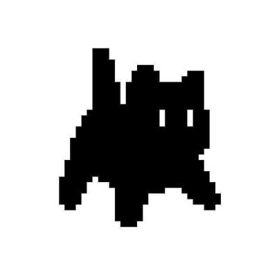
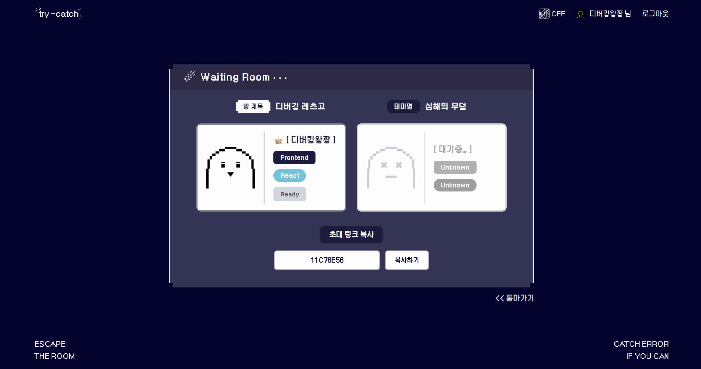
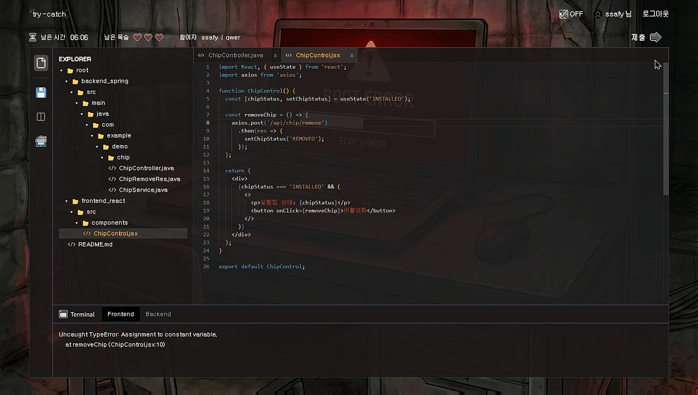
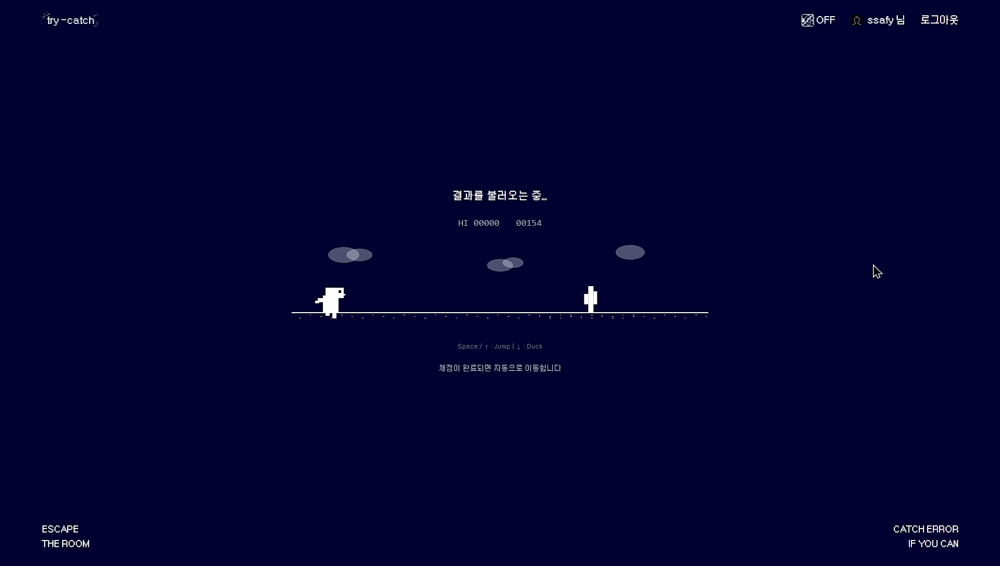
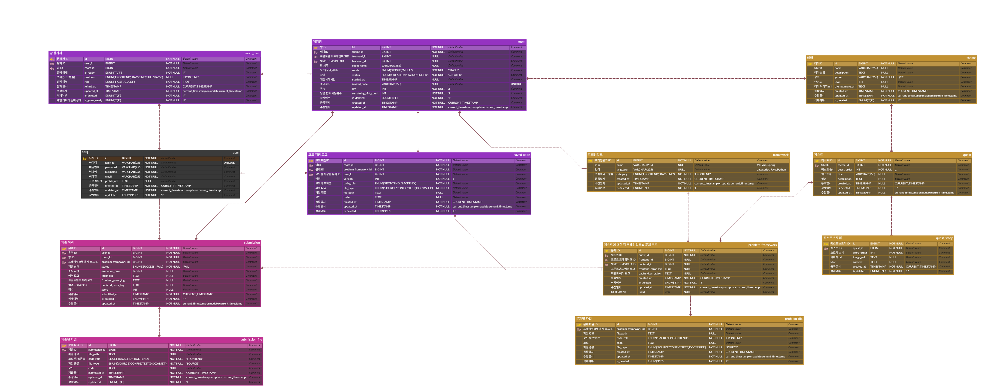
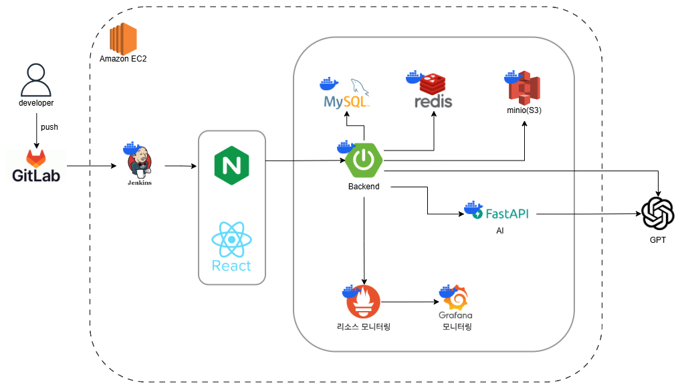
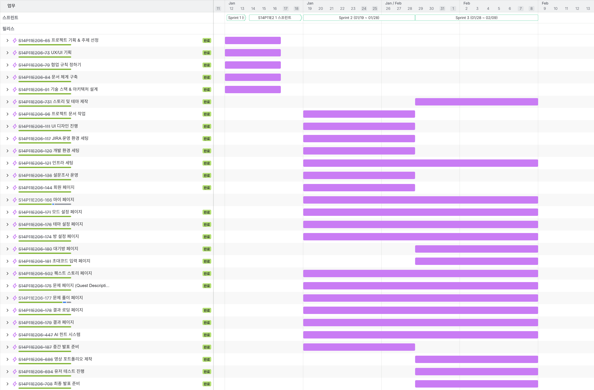

## try-catch

### 👀 목차

[✨ 서비스 소개](#-서비스-소개)  
[🗓️ 개발 일정](#️-개발-일정)  
[😊 팀 구성](#-팀-구성)  
[🛠️ 기술 스택](#️-기술-스택)  
[🎞️ 주요 기능 및 이미지](#️-주요-기능-및-이미지)  
[🖇️ ERD](#️-erd)  
[🌏 아키텍처 구조](#-아키텍처-구조)  
[📁 디렉터리 구조](#-디렉터리-구조)  
[📝 프로젝트 산출물](#-프로젝트-산출물)  
[✔️ Jira Issues](#️-jira-issues)

  

## ✨ 서비스 소개

  

**[방탈출 컨셉 게임으로 즐기는 실전 디버깅 학습 서비스]**

- **웹 IDE 환경**과 유사한 화면에서 **프레임워크 별 버그 코드를 직접 수정하며 탈출**합니다.
- **WebSocket + STOMP를 활용**한 멀티모드에서는 팀원과 역할을 나누어 각자 **버그를 해결하며 함께 탈출하는 협업 경험을 제공**합니다.
- **LLM 기반 AI 힌트 시스템**이 정답 없이 **단계별 힌트를 제공**합니다.
- **GPT API 기반 AI 채점 시스템**이 정답 코드의 점수를 매겨줍니다.  
   

## 🗓️ 개발 일정
**2026.01.05 ~ 2026.02.09(6주)**

- **1주차 (1/5 ~ 1/11)** : 프로젝트 기획
- **2주차 (1/12 ~ 1/18)** : 설계 및 구체화
- **3주차 (1/19 ~ 1/25)** : 인프라 및 구현
- **4주차 (1/26 ~2/1)** : 구현 및 연동
- **5주차 (2/2~2/8)** : 테스트, 마무리
- **2/9** : 최종 프로젝트 평가  
   

## 😊 팀 구성

    <table>
        <tr>
            <td width="33%" align="center"> 
                <a href="https://github.com/elfffffy">
                       <strong>박정원</strong> 
                </a>
                 (FE)
            </td>
            <td width="33%" align="center">
                <a href="https://github.com/JPW-star">
                       <strong>박준수</strong> 
                </a>
                 (Leader / FE / AI)
            </td>
            <td width="33%" align="center"> 
                <a href="https://github.com/seh8145">
                       <strong>송은혁</strong>
                </a> 
                  (BE)
            </td>
        </tr>
        <td width="280px" valign="top">
            
            - 게임 페이지 구현  
            - STOMP WebSocket 기반 멀티모드 실시간 동기화  
            - STOMP 클라이언트 유틸리티 모듈 설계  
            - Zustand 전역 상태 관리 설계 (Game, Socket, Submission store)  
            - 중간 발표  
            - JIRA 기반 프로젝트 일정 관리
            
        </td>
        <td width="280px" valign="top">
            
            - 결과 로딩 페이지/ 결과 페이지 구현  
            - 실시간 힌트 제공 챗봇 아키텍처 설계 및 구현(FAST API 서버 구축, LLM 기반)  
            - 테마 시나리오 작성 및 생성형 AI를 활용한 비주얼 에셋 생성  
            - 마이페이지/회원가입 페이지 구현  
            - 최종 발표
            
        </td>
        <td width="280px" valign="top">
            
            - 퀘스트 / 스토리 / 대기방 / 초대코드 API 구현  
            - WebSocket / STOMP 기반 실시간 멀티 플레이 시스템 구현  
            - 프레임워크 별 문제 리스트 제작  
            - 영상 제작
            
        </td>
        </tr>
    </table>
        <table>
        <tr>
            <td width="33%" align="center"> <a href="https://github.com/aidenjy42">
                   <strong>우주영</strong> </a>  (BE)   </td>
            <td width="33%" align="center"> <a href="https://github.com/wjdheesp44">
                   <strong>정희수</strong> </a>  (BE / DevOps / AI)   </td>
            <td width="33%" align="center"> <a href="https://github.com/chaezerojj">
                   <strong>진채영</strong> </a>  (FE / Design)   </td>
        </tr>
        <tr>
        <td width="280px" valign="top">
            
            - JWT 기반 인증 시스템 구현  
            - Security 설정 및 필터 구성  
            - Websocket config 및 인터셉터 설정  
            - 로그인/회원가입, 마이페이지 조회, 제출내역 조회 API 구현  
            - 멀티모드 코드 공유/불러오기 API 구현
            
        </td>
        <td width="280px" valign="top">
            
            - 제출 로직 API 구현  
            - WebSocket 타이머 설계  
            - 외부 API 연동  
            - 인프라 및 CI/CD 파이프라인 구축·운영
            
        </td>
        <td width="280px" valign="top">
            
            - 프론트엔드 개발환경 세팅 및 공통 레이아웃 구현  
            - 게임 진행 흐름 페이지 개발 (모드 선택 → 테마 선택 → 방 설정 → 대기방 → 퀘스트)  
            - STOMP WebSocket 기반 멀티모드 실시간 동기화 구현  
            - Zustand 스토어 설계 및 상태 관리 (Room, Lobby)  
            
        </td>
        </tr>
    </table>

 

## 🛠️ 기술 스택

<h3>🟣 Front-End </h3>

 

<h3>🔵 Back-End</h3>

 

<h3>🤖 AI</h3>

 

<h3>🖧 Infra & DevOps</h3>

 

<h3>🗄️ Database</h3>

 

<h3>⚙️ Tools</h3>

 

<h3>🖥️ Monitoring</h3>

  

## 🎞️ 주요 기능 및 이미지

    <table>
        <tr>
            <td align="center" width="50%">
                <b>01. 메인 화면</b>  
                
            </td>
            <td align="center" width="50%">
                <b>02. 모드 & 테마 선택</b>  
                
            </td>
        </tr>
        <tr>
            <td align="center">
                <b>03. 멀티 방 설정</b>  
                
            </td>
            <td align="center">
                <b>04. 멀티 방 초대</b>  
                
            </td>
        </tr>
        <tr>
            <td align="center">
                <b>05. 멀티 대기방 - 게스트 입장</b>  
                
            </td>
            <td align="center">
                <b>06. 멀티 대기방 - 게스트 준비</b>  
                
            </td>
        </tr>
        <tr>
            <td align="center">
                <b>07. 대기방 → 퀘스트 설명까지</b>  
                
            </td>
            <td align="center">
                <b>08. 게임 - README로 문제 확인</b>  
                
            </td>
        </tr>
        <tr>
            <td align="center">
                <b>09. 게임 - AI 힌트 확인</b>  
                
            </td>
            <td align="center">
                <b>10. 게임 - 코드 작성</b>  
                
            </td>
        </tr>
        <tr>
            <td align="center">
                <b>11. 게임 - 코드 저장</b>  
                
            </td>
            <td align="center">
                <b>12. 게임 - 코드 불러오기</b>  
                
            </td>
        </tr>
        <tr>
            <td align="center">
                <b>13. 코드 제출 후 대기하는 동안 공룡게임</b>  
                
            </td>
            <td align="center">
                <b>14. 공룡 게임 후 AI 채점 결과 확인(성공)</b>  
                
            </td>
        </tr>
        <tr>
            <td align="center">
                <b>15. 마이페이지 내 모드별 풀이 기록 확인</b>  
                
            </td>
            <td></td>
        </tr>
    </table>

 

## 🖇️ ERD

 

## 🌏 아키텍처 구조

 

## 📁 디렉터리 구조

    
<b>Front-End</b>

    📂frontend/src/
    ├─ main.tsx                         # 엔트리포인트
    ├─ App.tsx                          # 라우팅 설정 (React.lazy 코드 스플리팅)
    ├─ index.css                        # 전역 스타일 (Tailwind, 커스텀 폰트, 애니메이션)
    │
    ├─ 📁api/                           # API 레이어
    │  ├─ api.ts                        # Axios 인스턴스 + 인터셉터
    │  ├─ auth.ts                       # 인증 (로그인/회원가입/토큰갱신)
    │  ├─ roomApi.ts                    # 방 생성/참가
    │  ├─ themeApi.ts                   # 테마 목록
    │  ├─ questFile.ts                  # 퀘스트 파일 조회
    │  ├─ multiQuestFile.ts             # 멀티모드 퀘스트 파일 조회
    │  ├─ retryQuestFile.ts             # 재도전 퀘스트 파일 조회
    │  ├─ codeSubmission.ts             # 코드 제출
    │  ├─ submissionApi.ts              # 제출 결과
    │  ├─ hintApi.ts                    # AI 힌트
    │  ├─ gameSession.ts                # 멀티 게임 세션
    │  ├─ getSingleTimer.ts             # 타이머 조회
    │  ├─ startSingleGameTimer.ts       # 싱글 타이머 시작
    │  ├─ startMultiGameTimer.ts        # 멀티 타이머 시작
    │  ├─ questStories.ts               # 퀘스트 스토리 배경
    │  ├─ saveCodeForShare.ts           # 멀티모드 코드 저장
    │  ├─ shareCode.ts                  # 멀티모드 코드 불러오기
    │  └─ user.ts                       # 유저 정보
    │
    ├─ 📁stores/                        # Zustand 상태 관리
    │  ├─ useStore.ts                   # 유저/인증 상태
    │  ├─ useGameStore.ts               # 게임 진행 상태
    │  ├─ useRoomStore.ts               # 방 정보
    │  ├─ useLobbyStore.ts              # 멀티 로비
    │  ├─ useHintStore.ts               # 힌트 채팅
    │  ├─ useSubmissionStore.ts         # 코드 제출 상태
    │  ├─ useSocketStore.ts             # WebSocket 연결
    │  ├─ useResultStore.ts             # 결과 상태
    │  ├─ useSoundStore.ts              # 사운드 상태
    │  └─ room/                         # 방 관련 세분화 스토어
    │
    ├─ 📁sockets/                       # WebSocket
    │  ├─ stomp.ts                      # STOMP subscribe/publish
    │  └─ types.ts
    │
    ├─ 📁hooks/                         # 공통 훅
    │  ├─ useStompSubscription.ts       # STOMP 구독 래퍼
    │  ├─ useRoomSettingInit.ts         # 방 설정 초기화
    │  ├─ useAudio.ts                   # 오디오 재생
    │  ├─ useTypingSound.ts             # 타이핑 효과음
    │  └─ hooks.ts                      # 기타 공통 훅
    │
    ├─ 📁layouts/                       # 레이아웃
    │  ├─ AppLayout.tsx                 # Header + Outlet + Footer
    │  └─ index.tsx
    │
    ├─ 📁components/                    # 공통 UI
    │  ├─ common/                       # LoadingSpinner, ErrorMessage 등
    │  ├─ header/                       # Header, 로그인/아웃 메뉴
    │  ├─ footer/                       # Footer
    │  ├─ framer-motion/                # 페이지 전환 Wrapper
    │  ├─ effects/                      # 시각 효과
    │  ├─ routes/                       # PrivateRoute, GuestRoute
    │  ├─ sound/                        # 사운드 토글
    │  ├─ room-setting/                 # 방 설정 폼
    │  ├─ lobby/                        # 로비 UI
    │  ├─ invitation-code/              # 초대 코드
    │  ├─ quest/                        # 퀘스트 설명
    │  ├─ story/                        # 스토리
    │  ├─ nav/                          # 네비게이션
    │  └─ theme-selection/              # 테마 카드
    │
    ├─ 📁pages/                         # 페이지 (사용자 흐름 순)
    │  ├─ home/HomePage.tsx
    │  ├─ login/LoginPage.tsx
    │  ├─ signup/SignupPage.tsx
    │  ├─ mode-selection/ModeSelectionPage.tsx
    │  ├─ theme-selection/ThemeSelectionPage.tsx
    │  ├─ story/StoryPage.tsx
    │  ├─ room-settings/
    │  │  ├─ SingleRoomSettingPage.tsx
    │  │  └─ MultiRoomSettingPage.tsx
    │  ├─ multi-room/LobbyPage.tsx
    │  ├─ invitation-code/InvitationCodePage.tsx
    │  ├─ quest-description/QuestDescriptionPage.tsx
    │  ├─ dino-game/DinoGamePage.tsx
    │  ├─ game/                         # 메인 게임 페이지
    │  │  ├─ GamePage.tsx               # 게임 화면 (Monaco IDE 레이아웃)
    │  │  ├─ constants.ts               # 게임 상수
    │  │  ├─ 📁components/              # 게임 UI 컴포넌트
    │  │  │  ├─ CodeEditor.tsx          # Monaco Editor 래퍼
    │  │  │  ├─ EditorPanel.tsx         # 에디터 + 파일탭 패널
    │  │  │  ├─ MarkdownViewer.tsx      # 마크다운 뷰어 (lazy)
    │  │  │  ├─ Explorer.tsx            # 파일 탐색기
    │  │  │  ├─ Node.tsx                # 파일 트리 노드
    │  │  │  ├─ FileTabs.tsx            # 열린 파일 탭
    │  │  │  ├─ MenuBar.tsx             # 좌측 메뉴바
    │  │  │  ├─ GameInfoBar.tsx         # 타이머/목숨/참여자 표시
    │  │  │  ├─ SubmitBtn.tsx           # 제출 버튼
    │  │  │  ├─ Terminal.tsx            # 터미널 컨테이너
    │  │  │  ├─ TerminalTabs.tsx        # 터미널 탭
    │  │  │  ├─ TerminalLogView.tsx     # 에러 로그 뷰어
    │  │  │  ├─ TimeOverModal.tsx       # 시간 초과 모달
    │  │  │  ├─ 📁hint/                # AI 힌트
    │  │  │  │  ├─ HintButton.tsx
    │  │  │  │  ├─ HintModal.tsx        # 힌트 모달 (lazy)
    │  │  │  │  ├─ HintInputForm.tsx
    │  │  │  │  ├─ HintMessageList.tsx
    │  │  │  │  ├─ HintMessageItem.tsx
    │  │  │  │  ├─ HintInfoTooltip.tsx
    │  │  │  │  ├─ hintInfoMessages.ts
    │  │  │  │  └─ TypingIndicator.tsx
    │  │  │  └─ 📁toast/               # 제출 확인 토스트
    │  │  │     ├─ SubmitConfirmToast.tsx
    │  │  │     ├─ ShareCodeToast.tsx
    │  │  │     └─ toastStyles.ts
    │  │  ├─ 📁hooks/                   # 게임 전용 훅
    │  │  │  ├─ useGameInit.ts          # 게임 초기화 (API 병렬 호출)
    │  │  │  ├─ useFile.ts              # 파일 트리 구성
    │  │  │  ├─ useIde.ts               # IDE 상태 (탭, 코드, 스플릿)
    │  │  │  ├─ useTimer.ts             # 타이머 표시
    │  │  │  ├─ useTerminal.ts          # 에러 로그 관리
    │  │  │  ├─ useBackgroundImage.ts   # 배경 이미지 로드
    │  │  │  └─ useStompSubscription.ts # 멀티모드 STOMP 구독
    │  │  ├─ 📁types/                   # 타입 정의
    │  │  │  ├─ apiTypes.ts
    │  │  │  └─ ideTypes.ts
    │  │  └─ 📁utils/                   # 유틸리티
    │  │     ├─ fileTreeUtils.ts
    │  │     ├─ frameworkUtils.ts
    │  │     └─ submissionUtils.ts
    │  ├─ result/                       # 결과 페이지
    │  │  ├─ ResultPage.tsx
    │  │  ├─ ResultLoadingPage.tsx
    │  │  ├─ 📁components/              # 성공/실패 결과 화면
    │  │  │  ├─ SuccessResult.tsx
    │  │  │  ├─ SingleFailResult.tsx
    │  │  │  ├─ MultiFailResult.tsx
    │  │  │  └─ ErrorDisplay.tsx
    │  │  ├─ hooks/
    │  │  ├─ types/
    │  │  └─ utils/
    │  └─ mypage/MyPage.tsx
    │
    └─ 📁utils/                         # 유틸리티
        ├─ errorUtils.ts
        ├─ validationUtils.ts
        ├─ participantUtils.ts
        ├─ logger.ts
        └─ utils.ts

    
<b>Back-End</b>

    📁backend/src
    ├─📁main
    │  ├─📁java
    │  │  └─io
    │  │      └─ssafy
    │  │          └─📁trycatch
    │  │              ├─📁domain
    │  │              │  ├─📁ai
    │  │              │  │  ├─client
    │  │              │  │  └─dto
    │  │              │  │      ├─request
    │  │              │  │      └─response
    │  │              │  ├─📁file
    │  │              │  │  ├─controller
    │  │              │  │  └─service
    │  │              │  ├─📁game
    │  │              │  │  ├─controller
    │  │              │  │  ├─dto
    │  │              │  │  │  ├─request
    │  │              │  │  │  └─response
    │  │              │  │  ├─entity
    │  │              │  │  ├─mapper
    │  │              │  │  ├─repository
    │  │              │  │  └─service
    │  │              │  ├─📁hint
    │  │              │  │  ├─controller
    │  │              │  │  ├─dto
    │  │              │  │  │  ├─request
    │  │              │  │  │  └─response
    │  │              │  │  ├─entity
    │  │              │  │  └─service
    │  │              │  ├─📁room
    │  │              │  │  ├─controller
    │  │              │  │  ├─dto
    │  │              │  │  │  ├─request
    │  │              │  │  │  └─response
    │  │              │  │  ├─entity
    │  │              │  │  ├─enums
    │  │              │  │  ├─handler
    │  │              │  │  ├─repository
    │  │              │  │  └─service
    │  │              │  ├─📁submission
    │  │              │  │  ├─controller
    │  │              │  │  ├─dto
    │  │              │  │  │  ├─request
    │  │              │  │  │  └─response
    │  │              │  │  ├─entity
    │  │              │  │  ├─repository
    │  │              │  │  └─service
    │  │              │  └─📁user
    │  │              │      ├─controller
    │  │              │      ├─dto
    │  │              │      │  ├─request
    │  │              │      │  └─response
    │  │              │      ├─entity
    │  │              │      ├─mapper
    │  │              │      ├─repository
    │  │              │      └─service
    │  │              ├─📁global
    │  │              │  ├─auth
    │  │              │  │  └─jwt
    │  │              │  ├─common
    │  │              │  ├─config
    │  │              │  ├─exception
    │  │              │  ├─filter
    │  │              │  └─security
    │  │              └─📁websocket
    │  │                  ├─common
    │  │                  ├─config
    │  │                  ├─dto
    │  │                  │  ├─game
    │  │                  │  ├─hint
    │  │                  │  └─lobby
    │  │                  ├─handler
    │  │                  └─interceptor
    │  └─📁resources
    │      ├─mapper
    │      │  ├─game
    │      │  ├─room
    │      │  └─user
    │      └─static
    └─📁test
        └─java
            └─io
                └─ssafy
                    └─trycatch

    
<b>AI</b>

    📂ai-server/
    ├─ Dockerfile
    ├─ requirements.txt
    ├─ 📁app/
    │  ├─ main.py                    # FastAPI 앱 초기화
    │  ├─ config.py                  # 환경변수 설정
    │  ├─ routers.py                 # API 라우터 (/hint, /health)
    │  │
    │  ├─ 📁schemas/                   # 요청/응답 스키마
    │  │  ├─ hint.py                 # 힌트 요청/응답
    │  │  ├─ guardrail.py            # 가드레일 검증 결과
    │  │  ├─ user_code.py            # 사용자 코드 컨텍스트
    │  │  └─ health.py               # 헬스 체크
    │  │
    │  ├─ 📁services/                  # 비즈니스 로직
    │  │  ├─ guardrail.py            # 질문 검증 (3축 분류)
    │  │  ├─ hint_generator.py       # 힌트 생성
    │  │  └─ backend_client.py       # 백엔드 서버 통신
    │  │
    │  └─ 📁prompts/                   # LLM 프롬프트
    │     ├─ guardrail_prompt.py     # 가드레일 프롬프트
    │     └─ hint_prompts.py         # 프레임워크별 힌트 프롬프트
    │
    └─ 📁tests/                        # 프롬프트 정량 검증
        ├─ test_guardrail_accuracy.py # A/B/C 변형 비교 테스트
        ├─ test_data.py               # 테스트 케이스 50개
        ├─ prompt_variants.py         # 프롬프트 변형 정의
        └─ 📁results/
            └─ result_*.json           # 실험 결과

 

## 📝 프로젝트 산출물

[**⚪ 기획서**](https://www.notion.so/2ea70a13d69a80e7b723c1df39a410a7?pvs=21)

[**⚪ 기능 명세서**](https://www.notion.so/infinity-platinum-ad1/2e770a13d69a80eb9342e8f0ed25e1ce)

[**⚪ ERD**](https://www.erdcloud.com/d/FdvoYJgdFCbtvtBCx)

[**⚪ API 명세서**](https://www.notion.so/infinity-platinum-ad1/API-2e870a13d69a80629aa3ed8cd78a28e0)

[**⚪ 발표 자료**](https://drive.google.com/drive/u/0/folders/1onVcFV8c7dH82RdyhvgLq9hqbCHTS-8G)

 

## ✔️ Jira Issues

