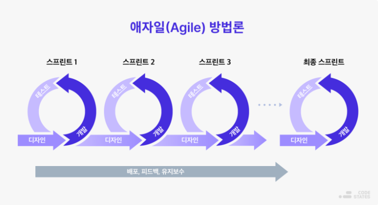
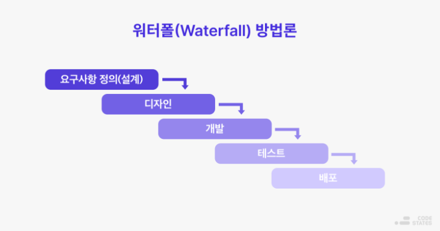
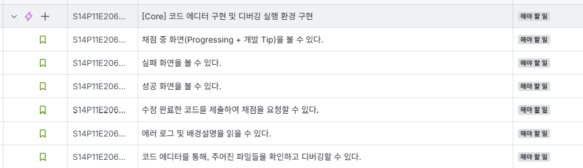

## 1️⃣ 애자일 방법론 이란?

**애자일**은 '기민한, 민첩한' 이라는 뜻으로 변화하는 고객 요구 사항에 대응할 수 있도록

1. 짧은 단위로 기능을 개발하고
2. 사용자 관점으로 점검하고
3. 피드백을 반영을

반복하며 완성도를 올리는 개발 방식이다.

---

### ✨ Before Agile, there is Waterfall

**폭포수 방법론**은 작업이 폭포처럼 위에서 아래로 떨어지는 단계별 개발 방법론이다.

아래와 같은 과정을 진행하게 된다.

1. 요구사항 정의
2. 디자인
3. 개발
4. 테스트
5. 배포

폭포수 방법론은 단계별로 업무를 분담하기 때문에 맡은 바가 명확하다는 것이 장점이다.  
하지만, **속도가 느리고, 유연하지 못하다**는 단점이 있다.

그래서 고객의 요구사항을 빠르게 대처하지 못하는 경직성 때문에  
**애자일 방법론**이 등장했다.

---

### ✨ 애자일 소프트웨어 개발 선언

> 공정과 도구보다 **개인과 상호작용**을  
> 포괄적인 문서보다 **작동하는 소프트웨어**를  
> 계약 협상보다 **고객과의 협력**을  
> 계획을 따르기보다 변**화에 대응하기**를  
> 가치 있게 여긴다.

---

## 2️⃣ 우리 프로젝트에서는?

우리 프로젝트에서는 WebSocket을 사용할 예정이기 때문에 기술 리스크 기능을 먼저 작게 성공시키는 것이 좋다.

또한, 핵심 기능부터 완성해서 최소한 발표 가능한 상태를 만들려고 하기 때문에, **Agile 방식** 적극 따르기로 했다.

▶️ **JIRA**를 활용한 애자일 기반 스프린트 일정 관리

> 현재는 작업 이슈는 생성돼 있지만, 아직 스프린트로 할당되어 있지는 않은 상태입니다.

