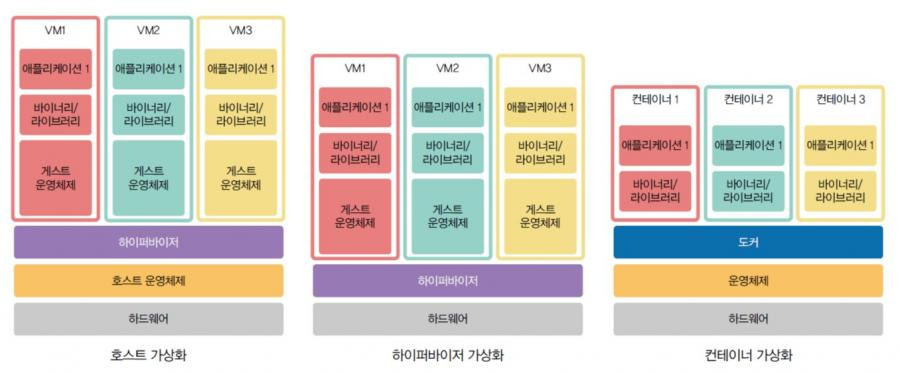
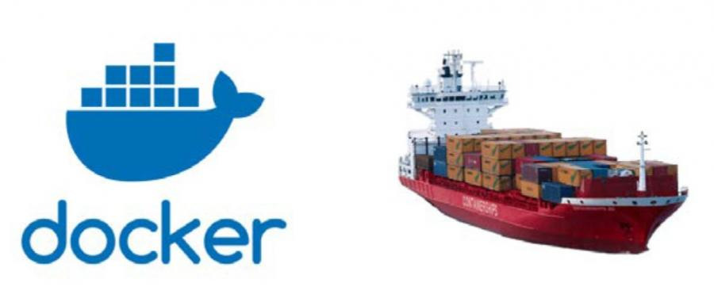

## 1️⃣ 컨테이너(Container)

**컨테이너(Container)** 는 애플리케이션을 실행할 때 필요한
코드 + 라이브러리 + 설정 파일 등 모든 종속성을 하나로 묶어 패키징한 소프트웨어 실행 단위이다.

개발 환경이 다르더라도 컨테이너 안에는 실행에 필요한 요소들이 모두 포함되어 있기 때문에,
⭐ 어떤 환경에서도 빠르고 안정적으로 동일하게 실행될 수 있다.

### ✅ 컨테이너의 장점

- 컨테이너는 OS(운영체제)를 공유하기 때문에 가상 머신(VM)보다 가볍고 실행 속도가 빠르다.
- 애플리케이션 단위로 실행 환경이 분리되므로 앱 별 격리성도 뛰어나다.

### ❌ 컨테이너의 단점

- OS에 문제가 생기면 다른 컨테이너(앱)에도 영향을 줄 수 있다.

---

## 2️⃣ 도커(Docker)

**도커(Docker)** 는 컨테이너 기술을 실제로 쉽게 사용할 수 있도록 만들어주는
대표적인 컨테이너 플랫폼이다.

### ✨ 도커의 장점

- 이식성이 높다.
- 환경 차이에 영향을 받지 않기 때문에 유연성이 높다.
- 배포 및 운영 과정이 단순해져 운영 효율성도 높다.

---

### 🏗️ 도커가 컨테이너를 만드는 과정

1. 애플리케이션 구동에 필요한 패키지, 환경 변수 설정, 실행 명령어 등을 **Dockerfile**에 작성한다.
2. Dockerfile을 기반으로 `docker build`를 실행하면 **Docker 이미지(Image)**가 생성된다.
3. 생성된 이미지를 `docker run`으로 실행하면 여러 개의 **Docker 컨테이너(Container)** 가 생성된다.
4. 컨테이너 내부에서는 이미지에 포함된 프로그램과 설정이 그대로 적용되어 **실제 컴퓨팅 자원 위에서 실행**된다.

---

### 📌 핵심 용어 정리

- **Dockerfile**: 애플리케이션 실행 환경을 만들기 위한 패키지, 환경 변수 설정 등을 기록한 파일

- **Docker Image**: 컨테이너 실행에 필요한 파일과 설정값 등을 포함한 불변 템플릿

- **Docker Container**: 이미지에 정의된 프로그램과 설정이 실제 컴퓨터 자원과 연결되어 실행되는 공간

---

## ☘️ 참고

참고로 위 내용은 제 tistory에도 올려두었습니다!  
링크 들어가시면 확인 가능합니다😊  
👉 [4. 클라우드 (2)](https://elffffy.tistory.com/6)
