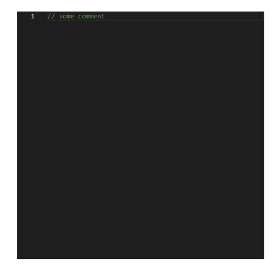
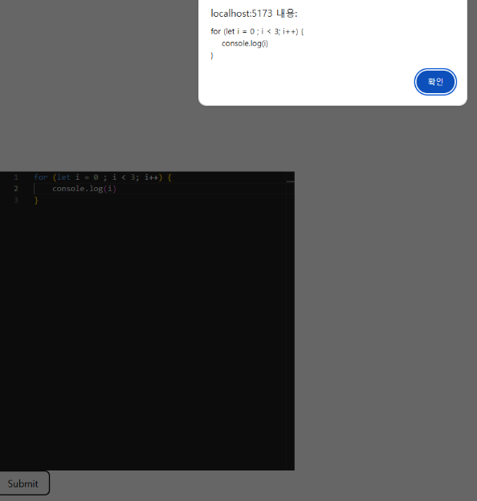

> ⚡monaco-practice 폴더를 참고하세요.

## 1️⃣ React + Vite 프로젝트 생성

```bash
npm create vite@latest
```

> #### 📍Vite란?
>
> Vite는 **프론트엔드 개발용 빌드 도구(개발 도구)** 이다.  
> React/Vue 같은 프로젝트를 빠르게 실행하고, 수정 즉시 반영되게 해주고, 배포용 파일까지 생성할 수 있도록 도와준다.

위 코드를 실행하면 나오는 설정들은 다음과 같이 설정했다.

1. Project name : monaco-practice
2. Select a framework : React
3. Select a variant : TypeScript

이후, 바로 실행하고 싶다면, Yes를 선택하면 다음 아래 코드는 자동으로 실행된다.

```bash
npm install
npm run dev
```

## 2️⃣ Monaco-editor 설치

### 📌 Socket.IO 공식 문서

아쉽게도 한국어 지원은 없다 😢  
👉 [monaco-editor/react 바로가기](https://www.npmjs.com/package/@monaco-editor/react)

```bash
npm install @monaco-editor/react
```

---

설치를 완료했다면, APP.tsx 파일에 적용을 하면 다음과 같다.

```ts
// monaco-editor를 React에서 쉽게 사용할 수 있게 감싸둔 라이브러리
import Editor from "@monaco-editor/react";

// monaco 타입 import (파일 형식이 typescript이기 때문에)
// 이벤트 타입을 지정하기 위해 가져옴
import type * as monaco from "monaco-editor";

function App() {
  // 에디터 내용이 바뀔 때 마다 실행되는 함수
  function handleEditorChange(
    value: string | undefined, // 현재 에디터 전채 내용(문자열)
    event: monaco.editor.IModelContentChangedEvent // 상세 변경 정보
  ) {
    console.log(value);
  }

  return (
    <div style={{ height: "500px", width: "500px" }}>
      <Editor
        height="100%"
        defaultLanguage="javascript" // 언어 모드 설정 (문법 하이라이팅 + 자동완성 적용)
        defaultValue="// some comment" // 에디터 기본 코드
        theme="vs-dark" // 테마 설정
        options={{ minimap: { enabled: false } }} // 옵션(미니맵 끄기)
        onChange={handleEditorChange} // 에디터 내용이 변경될 때마다 호출되는 함수
      />
    </div>
  );
}

export default App;
```

---

이렇게 하면, 기본적으로 다음과 같은 화면이 뜨게 된다.



---

## 3️⃣ Monaco-editor 확장

에디터까지는 구현을 했는데...  
내가 입력한 코드를 어떻게 갖고 쓸 수 있을까? 라는 생각이 들게 된다.

이를 위해 코드를 수정해야한다.

1. submit 버튼을 생성
2. 버튼을 누르면, alert 창에 내 코드 출력

```ts
import { useState } from "react"; // 상태 관리를 위한 useState 훅

function App() {
  // 에디터에 입력된 코드 내용을 저장할 state
  const [code, setCode] = useState<string>("");

  function handleEditorChange(
    value: string | undefined,
    event: monaco.editor.IModelContentChangedEvent
  ) {
    setCode(value ?? ""); // undefined라면 빈 문자열로 저장
  }

  // 현재 저장되어 있는 code를 alert로 띄우는 함수
  function showInput() {
    alert(code);
  }

  return (
    <div style={{ height: "500px", width: "500px" }}>
      ...
      {/* submit 버튼 클릭하면 showInput 실행 */}
      <button type="submit" onClick={showInput}>
        Submit
      </button>
    </div>
  );
}

export default App;
```



이렇게 잘 나오는 것을 확인할 수 있다.

---

## 4️⃣ 고민해볼 점

여기서 중요한 점은 우리 프로젝트에서 싱글 뿐만 아니라 멀티도 생각하고 있기 때문에 위의 예시처럼 useState에만 값을 넣으면 복잡해지고 관리가 어려워질 것이다.

그래서 확실하지 않지만,,,  
일단 첫 번째로 시도해 볼 방법을 소개하겠다.

---

### ✅ 해결 방법

첫 번째, 내 화면에서 타이핑을 하면

1. Monaco onChange가 발생한다.
2. store에 내 코드가 기록된다. ➡️ setCode(myFileId, newvalue)
3. 화면은 store를 보고 렌더링 한다.

---

두 번째, 내가 저장 버튼을 누르면,

1. store에 있는 내 코드를 가져온다.
2. API 요청으로 서버에 저장한다.
   1. 서버는 전달받은 코드를 DB에 저장하고, 파일의 version을 갱신한다.
   2. 서버는 저장된 결과를 응답한다. (success, newVersion, updatedAt)
   3. 서버는 WebPush로 '저장됨' 알림을 전송한다. (이때, 어떤 파일이 업데이트 되었는지만)
3. 저장 성공 응답을 받으면, store에서 저장 완료 처리를 한다.
   - dirty=fasle
   - version=newVersion
   - lastSavedAt = updateAt

---

세 번째, 상대방이 WebPush 알림을 받으면,

1. 알림에 포함된 fileId, newVersion을 기준으로, API 요청을 통해 최신 코드 내용을 불러온다.
2. 서버에서 받은 최신 코드를 store에 반영한다.
3. 상대방 화면은 store 값을 기반으로 즉시 렌더링 되어 확인한다.

---

### 📁 파일 동기화 구조 예시 (store + WebPush)

```json
// store에서 관리할 내용 예시
files: {
  "react-file": {
    fileId: "react-file",
    filename: "App.jsx",
    language: "javascript",
    owner: "ME",
    readOnly: false,
    content: "...",
    dirty: true,
    version: 12,
    updatedAt: "2026-01-15T12:20:00Z",
  },
  "spring-file": {
    fileId: "spring-file",
    filename: "UserService.java",
    language: "java",
    owner: "PARTNER",
    readOnly: true,
    content: "...",
    dirty: false,
    version: 7,
    updatedAt: "2026-01-15T12:21:00Z",
  }
}
```

```json
// WebPush payload 예시
{
  "type": "FILE_SAVED",
  "roomId": "R001",
  "fileId": "react-main",
  "savedBy": "userA",
  "newVersion": 13,
  "updatedAt": "2026-01-15T10:25:30Z"
}
```

---

## ☘️ 참고

참고로 위 내용은 제 tistory에도 올려두었습니다!  
링크 들어가시면 확인 가능합니다😊  
👉 [3. 웹에서 IDE 만들기? Monaco Editor 시작하기!](https://elffffy.tistory.com/9)
