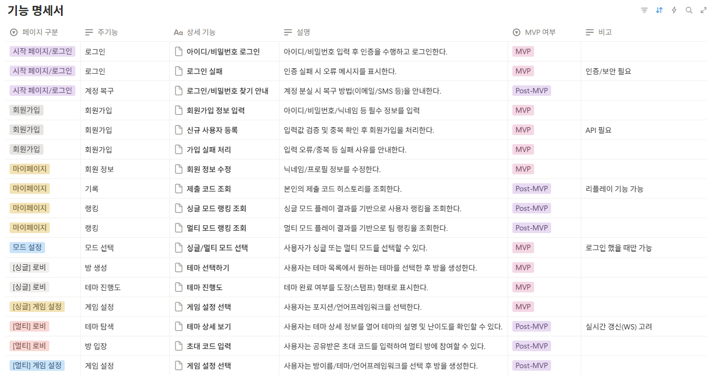
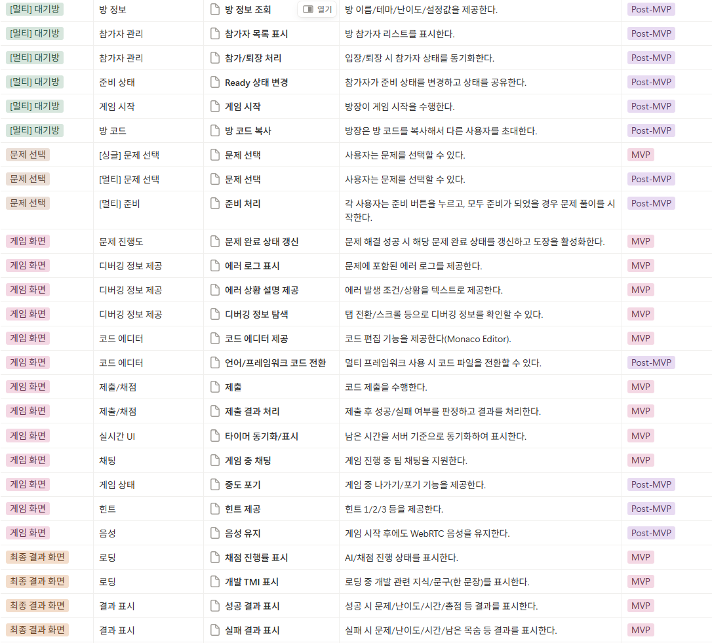
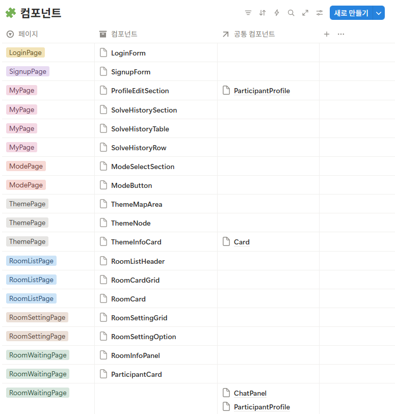
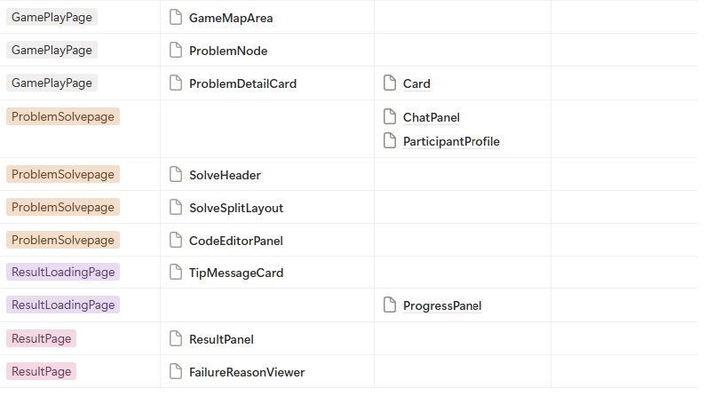
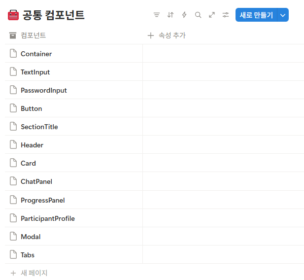

📌 `26.01.12 ~ 26.01.16` 진행 상황입니다.  
아래 내용은 개인적으로 정리한 내용입니다.

## 1️⃣ 프로젝트 기획서

### 1. 프로젝트 제목

**트라이 캐치(Try-Catch)**

> 버그가 곧 함정이고, 수정이 곧 열쇠입니다.  
> 싱글/멀티로 플레이하는 디버깅 방탈출 게임 플랫폼입니다.

---

### 2. 프로젝트 목표

**트라이 캐치**는 개발자(SSAFY 교육생)가 겪는 가장 큰 장벽 중 하나인 디버깅의 막막함을 **협업 기반 게임 경험으**로 바꾸는 것을 목표로 합니다.

#### 🎯 사용자에게 전달하고 싶은 핵심 가치

1. 디버깅을 혼자 버티는 것이 아니라 함께 풀어가는 협업 경험 제공
2. 단순 문제풀이가 아닌 실전처럼 소통하며 해결하는 훈련
3. 방탈출 스토리로 디버깅 과정을 게임처럼 즐길 수 있는 몰입형 경험 제공

---

### 3. 주요 기능 (MVP)

| 구분(화면)     | 목적                | 주요 기능(MVP)                                                                                                   |
| -------------- | ------------------- | ---------------------------------------------------------------------------------------------------------------- |
| 시작페이지     | 사용자 인증 및 식별 | 로그인 회원가입                                                                                               |
| 마이페이지     | 사용자 정보 관리    | 회원 정보 수정                                                                                                   |
| 모드 설정      | 플레이 방식 선택    | 싱글/멀티 모드 선택                                                                                              |
| 싱글 로비      | 게임 진입 준비      | 방 생성(테마 선택) 테마 진행도                                                                                |
| 문제 선택      | 플레이할 문제 선택  | 문제 선택 문제 진행도                                                                                         |
| 게임 화면      | 디버깅 플레이 진행  | 디버깅 정보 제공(에러 로그/에러 상황) 코드 에디터(Monaco Editor) 제출 및 채점 채팅 실시간 UI(타이머) |
| 최종 결과 화면 | 결과 확인 및 재도전 | 로딩 화면 성공/실패 결과 표시 다시하기                                                                     |

---

### 4. 기대 효과

#### ✅ 사용자 측면

- 디버깅을 두려워하지 않는 경험 제공
- 실패가 학습으로 이어지는 동기 부여 구조
- 단순 코딩이 아니라 문제 해결 능력 향상

✅ 팀/교육 관점

- 실시간 협업 훈련(소통, 역할 분담, 공유)
- 프로젝트형 학습의 확장 가능성 (추후 멀티 기능에서)

✅ 서비스 확장 가능성

- 다양한 언어/난이도/문제 유형 확장
- 커뮤니티/스터디 기반 협업 게임으로 발전 가능

---

## 2️⃣ 기능 명세서

---

## 3️⃣ 프론트 컴포넌트 정리

(추후 논의를 통해 수정할 내용입니다.)

