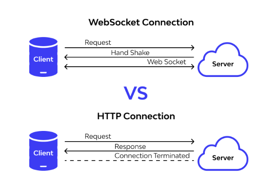

## 1️⃣ WebSocket 란?



웹소켓(WebSocket)이란, **브라우저와 서버가 연결을 계속 유지하면서 실시간으로 데이터를 주고 받는 통신 방식**이다. 또한 **TCP 기반**으로 동작한다.

> #### 📍 TCP (Transmission Control Protocol)
>
> TCP는 인터넷에서 데이터를 **정확하고 안전하게 전달하기 위한 통신 규칙**이다.
>
> #### TCP 특징
>
> - 데이터를 보내기 전에 먼저 연결을 맺는다.
> - 데이터가 중간에 누락/손상되거나 순서가 꼬이면 재전송하거나 순서를 정렬해 정확하게 전달한다.
> - 데이터를 보낸 순서 그대로 받을 수 있도록 **순서를 보장한다.**

추가적으로 TCP와 함께 많이 등장하는 개념인 UDP도 간단히 알아보면  
다음과 같다.

> #### 📍 UDP (User Datagram Protocol)
>
> UDP는 인터넷에서 데이터를 **빠르게 보내기 위한 통신 규칙**이다.
>
> #### UDP 특징
>
> - TCP처럼 연결 과정 없이 바로 전송한다.
> - 데이터가 누락되어도 재전송하지 않는다.
> - 속도가 빠르고 지연이 적다.

---

### ✅ 기존 HTTP 통신의 한계

기존의 HTTP 통신은 클라이언트가 서버에 요청(Request)을 보내면, 서버가 응답(Response)하는 방식으로 동작한다.

여기서 가장 큰 문제점은 클라이언트가 요청하지 않으면, 서버는 먼저 데이터를 보낼 수 없다.

그래서 새로운 메시지가 왔는지 확인하려면, **클라이언트가 계속 요청을 보내야 한다.**

이런 방식은 실시간 기능을 구현할 때 다음과 같은 문제가 발생한다.

- 불필요한 트래픽 발생
- 서버 비용 증가
- 요청/응답 구조로 인한 지연 시간 발생

결과적으로... 통신 효율성이 크게 떨어지는 구조이다 😰

▶️ 그래서 위의 문제를 해결하기 위해 등장한 것이 바로 **WebSocket**이다.

---

### ✨ WebSocket의 흐름

WebSocket의 주요 흐름은 다음과 같다.

1. 클라이언트가 서버에 연결을 요청한다.
2. 서버가 연결 요청을 승인한다. (**Handshake**)
3. 이후 서버와 브라우저는 연결이 유지된 상태로 통신한다.
4. 연결이 유지되는 동안 필요할 때마다 **양방향으로 실시간 데이터**를 주고받을 수 있다.

---

## 2️⃣ Socket.IO

### ✨ Socket.IO 란?

**Socket.IO**는 **실시간 통신을 쉽게 구현하도록 도와주는 라이브러리**이다.  
 WebSocket을 기반으로 동작하며, 다음과 같은 기능들이 기본적으로 제공된다.

---

### ✅ Socket.IO 주요 기능

#### 🟦 Room(방)

- 특정 그룹에 속한 사람들끼리만 메시지를 주고받게 하는 기능
- ⭐ 실시간 서비스는 거의 방 단위로 동작하기 때문에 중요한 기능이다.

---

#### 🟩 Namespace(네임스페이스)

- 통신 공간(소켓 연결 공간) 자체를 분리하는 기능
- 같은 서버를 쓰지만 URL 경로 느낌으로 통신을 분리한다.
- 예: `/chat`, `/game`

---

#### 🟨 자동 재접속

- 연결이 끊겼을 때 자동으로 연결을 시도해주는 기능

---

#### 🟥 이벤트 기반 통신 구조

- 기능 단위로 이벤트를 정의해 실시간 통신하는 기능

---

### 📌 Socket.IO 공식 문서

아쉽게도 한국어 지원은 없다 😢  
👉 [socket.io 바로가기](https://socket.io/docs/v4/tutorial/introduction)

---

### ✨ Socket.IO 이벤트 통신

Socket.IO는 이벤트 단위로 데이터를 주고받는다.

```js
// 해당 이벤트를 받고 콜백함수를 실행
socket.on("받을 이벤트 명", (msg) => {});

// 이벤트 명을 지정하고 메세지를 보낸다.
socket.emit("전송할 이벤트 명", msg);
```

---

## ☘️ 참고

참고로 위 내용은 제 tistory에도 올려두었습니다!  
링크 들어가시면 확인 가능합니다😊  
👉 [2. WebSocket, 넌 뭐니?](https://elffffy.tistory.com/8)
