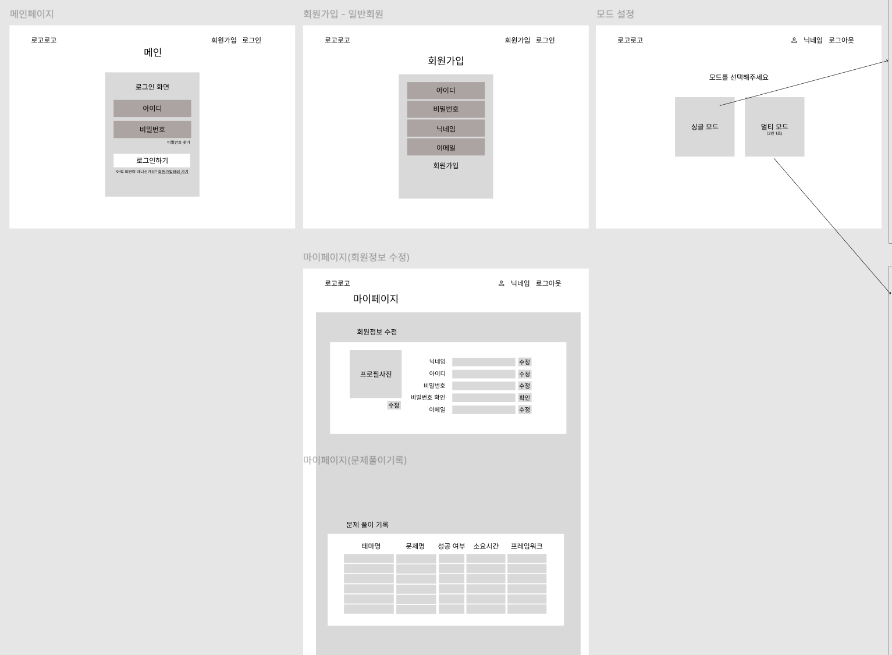

# 아이디어_구체화

# 프로젝트 개요

- **프로젝트명:** try-catch
- **한 줄 소개:** 실시간으로 협업해 디버깅 문제를 해결하는 게임형 서비스
- **핵심 키워드:** WebSocket / WebRTC / 실시간 협업 / 디버깅

---

## 화면 구성 (IA)

> ✨ = MVP 제외 기능
> 

### 1. 로그인/회원

| 기능 | MVP |
| --- | --- |
| 일반 로그인 | ✅ |
| 아이디/비밀번호 찾기 | ✅ |
| 소셜 로그인 | ✨ |

### 2. 메인 페이지

| 기능 | MVP |
| --- | --- |
| 싱글 모드 | ✅ |
| 멀티 모드 | ✨ |

---

### 3. 로비

| 기능 | MVP |
| --- | --- |
| 방 만들기 (+문제 선택) | ✅ |
| 방 리스트 조회 | ✨ |
| 프로그래밍 모드/난이도 설정 | ✨ |

### 4. 마이 페이지

| 기능 | MVP |
| --- | --- |
| 회원 정보 수정 | ✅ |
| 문제 기록 조회 (맞춘/틀린) | ✅ |
| 본인 제출 코드 조회 | ✨ |
| 문제 풀이 진행도 데이터 | ✨ |

---

### 5. 대기방 ✨

| 기능 | MVP |
| --- | --- |
| 텍스트 채팅 | ✨ |
| 음성 채팅 | ✨ |
| 게임 시작/준비 버튼 | ✨ |
| 포지션 선택 (백/프론트) | ✨ |

### 6. 게임 화면

| 구성 요소 | 설명 |
| --- | --- |
| 좌측 | 문제/설명 |
| 우측 | 코드 에디터 (Monaco Editor) |
| 상단/하단 | 타이머, 제출 버튼, 채팅, 힌트(✨) |

### 7. 최종 결과

| 기능 | MVP |
| --- | --- |
| 소요 시간 표시 | ✅ |
| 성공/실패 표시 | ✅ |
| 다시하기 / 로비로 | ✅ |

---

## 와이어프레임

## 기능 명세서

| 시작 페이지/로그인 | 로그인 | 아이디/비밀번호 로그인 | 아이디/비밀번호 입력 후 인증을 수행하고 로그인한다. |
| --- | --- | --- | --- |
| 시작 페이지/로그인 | 로그인 | 로그인 실패 | 인증 실패 시 오류 메시지를 표시한다. |
| 시작 페이지/로그인 | 계정 복구 | 로그인/비밀번호 찾기 안내 | 계정 분실 시 복구 방법(이메일/SMS 등)을 안내한다. |
| 회원가입 | 회원가입 | 회원가입 정보 입력 | 아이디/비밀번호/닉네임 등 필수 정보를 입력 |
| 회원가입 | 회원가입 | 신규 사용자 등록 | 입력값 검증 및 중복 확인 후 회원가입을 처리한다. |
| 회원가입 | 회원가입 | 가입 실패 처리 | 입력 오류/중복 등 실패 사유를 안내한다. |
| 마이페이지 | 회원 정보 | 회원 정보 수정 | 닉네임/프로필 정보를 수정한다. |
| 마이페이지 | 기록 | 제출 코드 조회 | 본인의 제출 코드 히스토리를 조회한다. |
| 마이페이지 | 랭킹 | 싱글 모드 랭킹 조회 | 싱글 모드 플레이 결과를 기반으로 사용자 랭킹을 조회한다. |
| 마이페이지 | 랭킹 | 멀티 모드 랭킹 조회 | 멀티 모드 플레이 결과를 기반으로 팀 랭킹을 조회한다. |
| 모드 설정 | 모드 선택 | 싱글/멀티 모드 선택 | 사용자가 싱글 또는 멀티 모드를 선택할 수 있다. |
| [싱글] 로비 | 방 생성 | 테마 선택하기 | 사용자는 테마 목록에서 원하는 테마를 선택한 후 방을 생성한다. |
| [싱글] 로비 | 테마 진행도 | 테마 진행도 | 테마 완료 여부를 도장(스탬프) 형태로 표시한다. |
| [싱글] 게임 설정 | 게임 설정 | 게임 설정 선택 | 사용자는 포지션/언어프레임워크를 선택한다. |
| [멀티] 로비 | 테마 탐색 | **테마 상세 보기** | 사용자는 테마 상세 정보를 열어 테마의 설명 및 난이도를 확인할 수 있다. |
| [멀티] 로비 | 방 입장 | 초대 코드 입력 | 사용자는 공유받은 초대 코드를 입력하여 멀티 방에 참여할 수 있다. |
| [멀티] 게임 설정 | 게임 설정 | 게임 설정 선택 | 사용자는 방이름/테마/언어프레임워크를 선택 후 방을 생성한다. |
| [멀티] 대기방 | 방 정보 | 방 정보 조회 | 방 이름/테마/난이도/설정값을 제공한다. |
| [멀티] 대기방 | 참가자 관리 | 참가자 목록 표시 | 방 참가자 리스트를 표시한다. |
| [멀티] 대기방 | 참가자 관리 | 참가/퇴장 처리 | 입장/퇴장 시 참가자 상태를 동기화한다. |
| [멀티] 대기방 | 준비 상태 | Ready 상태 변경 | 참가자가 준비 상태를 변경하고 상태를 공유한다. |
| [멀티] 대기방 | 게임 시작 | 게임 시작 | 방장이 게임 시작을 수행한다. |
| [멀티] 대기방 | 방 코드 | 방 코드 복사 | 방장은 방 코드를 복사해서 다른 사용자를 초대한다. |
| 문제 선택 | [싱글] 문제 선택 | 문제 선택 | 사용자는 문제를 선택할 수 있다. |
| 문제 선택 | [멀티] 문제 선택 | 문제 선택 | 사용자는 문제를 선택할 수 있다. |
| 문제 선택 | [멀티] 준비 | 준비 처리 | 각 사용자는 준비 버튼을 누르고, 모두 준비가 되었을 경우 문제 풀이를 시작한다. |
| 게임 화면 | 문제 진행도 | 문제 완료 상태 갱신 | 문제 해결 성공 시 해당 문제 완료 상태를 갱신하고 도장을 활성화한다. |
| 게임 화면 | 디버깅 정보 제공 | 에러 로그 표시 | 문제에 포함된 에러 로그를 제공한다. |
| 게임 화면 | 디버깅 정보 제공 | 에러 상황 설명 제공 | 에러 발생 조건/상황을 텍스트로 제공한다. |
| 게임 화면 | 디버깅 정보 제공 | 디버깅 정보 탐색 | 탭 전환/스크롤 등으로 디버깅 정보를 확인할 수 있다. |
| 게임 화면 | 코드 에디터 | 코드 에디터 제공 | 코드 편집 기능을 제공한다(Monaco Editor). |
| 게임 화면 | 코드 에디터 | 언어/프레임워크 코드 전환 | 멀티 프레임워크 사용 시 코드 파일을 전환할 수 있다. |
| 게임 화면 | 제출/채점 | 제출 | 코드 제출을 수행한다. |
| 게임 화면 | 제출/채점 | 제출 결과 처리 | 제출 후 성공/실패 여부를 판정하고 결과를 처리한다. |
| 게임 화면 | 실시간 UI | 타이머 동기화/표시 | 남은 시간을 서버 기준으로 동기화하여 표시한다. |
| 게임 화면 | 채팅 | 게임 중 채팅 | 게임 진행 중 팀 채팅을 지원한다. |
| 게임 화면 | 게임 상태 | 중도 포기 | 게임 중 나가기/포기 기능을 제공한다. |
| 게임 화면 | 힌트 | 힌트 제공 | 힌트 1/2/3 등을 제공한다. |
| 게임 화면 | 음성 | 음성 유지 | 게임 시작 후에도 WebRTC 음성을 유지한다. |
| 최종 결과 화면 | 로딩 | 채점 진행률 표시 | AI/채점 진행 상태를 표시한다. |
| 최종 결과 화면 | 로딩 | 개발 TMI 표시 | 로딩 중 개발 관련 지식/문구(한 문장)를 표시한다. |
| 최종 결과 화면 | 결과 표시 | 성공 결과 표시 | 성공 시 문제/난이도/시간/총점 등 결과를 표시한다. |
| 최종 결과 화면 | 결과 표시 | 실패 결과 표시 | 실패 시 문제/난이도/시간/남은 목숨 등 결과를 표시한다. |
| 최종 결과 화면 | 결과 표시 | 실패 원인 표시 | 실패 원인(에러 로그 등)을 제공한다. |
| 최종 결과 화면 | 재시작 | 다시하기 | 동일 문제로 다시 플레이를 시작한다. |

## 기술 스택

### Frontend

| 분류 | 기술 |
| --- | --- |
| 프레임워크 | React + Vite + TypeScript |
| 라우팅 | React Router DOM |
| 상태 관리 | Zustand |
| 스타일 | Tailwind CSS |
| 코드 에디터 | `@monaco-editor/react` |
| 품질 도구 | ESLint + Prettier |
| 실시간 통신 | Socket.IO (텍스트), WebRTC (음성) |
| 오디오 | Howler.js + Context API |

**Monaco Editor 이슈:**

- Spring Boot 직접 지원 안 됨 → Java 모드로 대체
- 해결 방안: 커스텀 자동완성 (`registerCompletionItemProvider`)

### Backend

| 분류 | 기술 |
| --- | --- |
| 프레임워크 | Spring Boot |
| ORM | JPA, MyBatis |
| 빌드 | Gradle |
| 인증 | Spring Security + JWT |
| 실시간 | WebSocket (STOMP) |
| 음성 통신 | WebRTC |
| DB | MySQL |
| 캐시 | Redis |
| AI | LLM API (채점 로직) |

### Infra (WebRTC 관련)

| 구성 요소 | 역할 |
| --- | --- |
| STUN 서버 | NAT 통과 지원 |
| TURN 서버 (Coturn) | NAT 환경 릴레이 |

### Redis 활용

- 룸 상태 캐시
- 레디 집계
- 타이머 (deadline)
- 인원 제한 동시성 제어
- WebSocket 세션 매핑