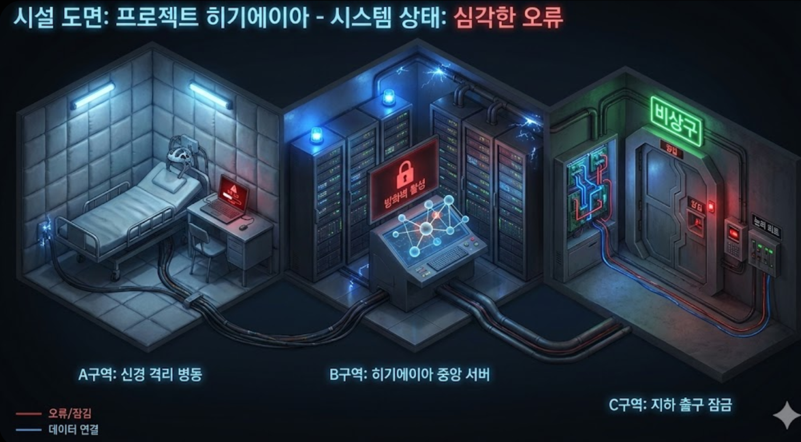

# 테마 스토리

생성일: 2026년 1월 15일

<aside>

## 테마: 물바다 (예시)

### 테마 설명

사무실은 물바다이고 조명이 깜빡거립니다. B구역으로 가는 길목에 끊어진 전선이 물에 닿아

치명적인 스파크가 튀고 있어 접근이 불가능합니다.

먼저, 필요한 도구를 찾고 차단기를 내려야 할 것 같습니다.

- Quest 1)
    - 물을 막을 도구를 얻고, 차단기를 내린다.
- Quest 2)
    - 터진 배관의 메인 밸프를 잠근다.
- Quest 3)
    - 비상구 레버를 내리고 탈출한다.
</aside>

<aside>

## 테마: 프로젝트 히기에이아 (정신병동 컨셉)

### 테마 설명

불법 뇌 실험이 자행되는 하이테크 비밀 시설에서 탈출해라! 본인의 뇌에는 실험칩이 심어져 있다.

시설을 통제하는 메인 AI ‘히기에이아’가 원인 불명의 오류를 일으킨 틈을 타 탈출하라!

- Quest 1)
    - 노트북을 통해 서버에 접속하여 자신의 뇌에 심어진 실험칩을 꺼라!
- Quest 2)
    - 지하출구로 가는 문은 높은 보안 권한이 필요하다. 중앙 서버 시스템을 조작하여 관리자 권한을 획득하라!
- Quest 3)
    - 최종 출구인 지하 출구에 왔지만, 비상 봉쇄 프로토콜로 인해 문이 굳게 잠겨있다.
    옆의 회로를 조작하면 문을 열 수 있을 것 같다.
    
</aside>

<aside>

## 테마: 심해의 무덤: 4000M

### 테마 설명

심해 4000미터 아래에 있는 심해 탐사 기지의 연락이 두절되었다.

당신은 이 상황을 파악하고, 탐사 기지 안의 데이터 칩을 가져오기 위해 투입되었다.

- Quest 1)
    
    탐사 기지 안에 진입하니, 어두워서 아무것도 보이지 않는다. 우선 중앙 제어 시스템의 전원을 켜야할 것 같다.
    
- Quest 2)
    
    전원을 키니, 연구원들의 시체가 널부러져 있다. 생존자는 없는 것으로 보인다.
    데이터 칩을 찾는 중, 갑자기 보안 드론이 자신을 공격하기 시작하였다. 이를 해결하기 위해, 보안 드론의 제어를 되찾아라.
    
- Quest 3)
    
    보안 드론 권한을 되찾았다. 보안 드론에 피가 묻어있는 것을 보니, 보안 드론이 오작동하여 연구원들을 공격해서 사고가 발생한 것 같다. 데이터 칩을 수거를 마친 직후, 갑자기 윙윙 소리가 들리며, 탈출구의 문이 잠겼다. 문을 직접 열지 않으면 이곳에 영원히 갖힐 것 같다. 문 옆의 회로를 조작하여 탈출하자!
    
</aside>