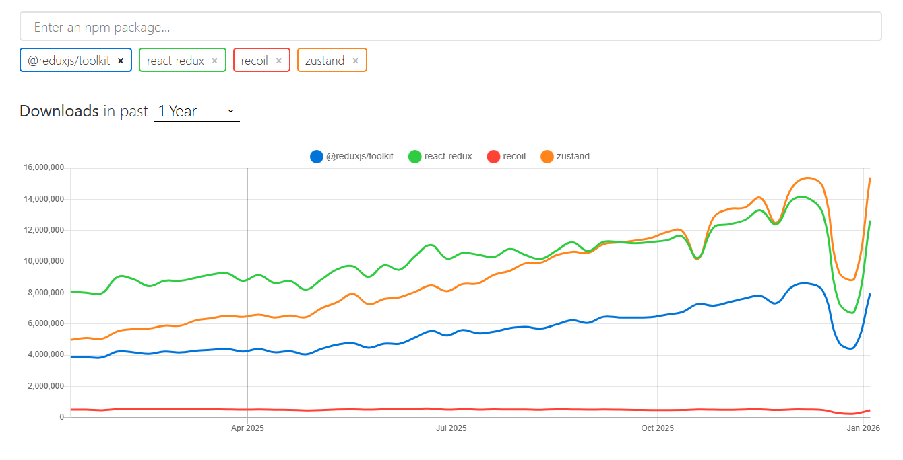

# 프로젝트 계획서

생성일: 2026년 1월 13일

### 🗂️ 목차

- 🖥️ **화면 및 기능 이미지** (플립보드)
    
    _(1).png)
    

# **🔍 프로젝트 개요**

- **프로젝트명**: 에러스케이프(가칭)
- **한 줄 소개**: 실시간으로 협업해 디버깅 문제를 해결하는 게임형 서비스
- **핵심 키워드**: WebSocket / WebRTC / 실시간 협업 / 디버깅

---

# **핵심 기능 요약 (MVP 중심)**

### **✅ MVP 핵심 경험**

- [MVP 정리](https://www.notion.so/MVP-2e870a13d69a803f882afbcf6b2e69f2?pvs=21)
- 로그인/회원가입
- 게임을 시작하고 **문제 해결 + 제출**
- **성공/실패 + 소요시간 + 결과 확인**

---

# **화면 구성(IA) & 기능 목록**

> ✨ 마크는  MVP에서 제외된 기능을 의미합니다.
> 

---

## **🖥️ 화면 1. 로그인/회원**

### **목적**

유저 인증 및 사용자 식별

### **주요 기능**

- 일반 로그인
- 아이디/비밀번호 찾기
- 소셜 로그인 ✨

### **비고**

- MVP에서는 “닉네임 로그인”으로 단순화 가능

---

## **🖥️ 화면 2. 메인 페이지**

### **목적**

플레이 모드 선택

### **주요 기능**

- 싱글 모드
- 멀티 모드 ✨

---

## **🖥️ 화면 3. 로비**

### **목적**

게임방 생성/입장 진입점

### **주요 기능**

- 방 리스트 조회 ✨
- 방 만들기 (+문제 선택/싱글도 필요)
- 프로그래밍 모드와 난이도 설정 ✨

---

## **🖥️ 화면 4. 마이 페이지**

### **목적**

사용자 설정/기록 확인

### **주요 기능**

- 회원 정보 수정
- 문제 기록 조회 (맞춘/틀린)
- 본인 제출 코드 조회 ✨
- 문제 풀이 진행도 데이터 ✨

---

## **🖥️ 화면 5. 대기방** ✨

### **목적**

게임 시작 전 준비 공간 (실시간 기능 집중)

### **주요 기능**

- 텍스트 채팅
- 음성 채팅
- 게임 시작 및 준비 버튼
- 포지션 선택(백/프)

---

## **🖥️ 화면 6. 게임 화면**

### **목적**

문제를 해결하는 본 게임 플레이 화면

### **구성 요소**

- 좌측: **문제/설명**
- 우측: **코드 에디터 (Monaco Editor)**
- 상단/하단: **실시간 요소**
    - 타이머
    - 제출 버튼
    - 채팅 (음성 채팅 포함)
    - 힌트 1, 2, 3 ✨
        
        ---
        

## **🖥️ 화면 7. 최종 결과**

### **목적**

게임 종료 후 결과 정리

### **주요 기능**

- 소요 시간
- 성공/실패
- 다시하기 / 로비로

---

# ✨기술 스택

## ⬜ Front-End

- 기본 프레임워크
    - React + Vite
    - TypeScript
    - React Router DOM
- 전역 상태 관리
    - Zustand
    - ~~Redux Toolkit~~
    - 참고 문서
        
        https://yong-nyong.tistory.com/94
        
        
        
        2026년 01월 기준 :  zustand > react-dedux > @reduxjs/toolkit > reciuk
        
- 스타일/UI
    - Tailwind CSS
    - ~~Bootstrap~~
- 코드 에디터
    - **`@monaco-editor/react`**
        - 코드 편집
        - 언어 선택
        - 자동완성/하이라이트
        - 제출 시 code string 가져오기
        - monaco-editor는 SpringBoot 지원 안해줘서 방안 찾아봐야 함..!
            - Java는 지원되므로 자바로 활용해봐야할지도
            - 해결 방안들
                
                LSP를 붙여야 하는데, 프로젝트 단위 분석이 필요해서 매 게임마다 세션이 무거워져서 서버 리소스를 많이 먹는다고 합니다.. 
                
                다음 선택지 2개가 최선일 것 같습니다.
                
                
                
                또는,,, 커스텀 자동 완성 만들기
                
                spring에서 많이 쓰는 애들만 등록 →
                
                **`monaco.languages.registerCompletionItemProvider("java", ...)`** 로 CompletionItemProvider를 등록하는 것.
                
                자주 사용 하는 애들 관련해서는 벡분들의 의견을 들어봐도 좋을 것 같습니다!
                
                
                
- 품질/편의 도구
    - ESLint + Prettier
- 실시간 통신
    - 텍스트 → `Socket.IO`
    - 음성 → `WebRTC`
        - howler.js + Context API 활용
            - **Howler.js**를 설치한다.
            - **Context API**로 전역 오디오 관리자를 만든다 (여기서 페이드인/아웃 처리).
            - 각 페이지의 `useEffect`에서 원하는 트랙을 요청한다.
            - **최초 진입 시 클릭 유도 버튼**을 만들어 브라우저 자동 재생 정책을 우회한다.
        

## ⬛ Back-End

- Spring Boot
    - JPA, MyBatis
    - gradle - ci/cd에 효과적
    - Spring Security , JWT
- WebSocket (STOMP) - 채팅
- WS Handshake 인증(연결 시 사용자 확정)
- DB: MySQL (방, 매치, 점수, 제출 기록, 힌트, 목숨)
- Redis:
    - 룸 상태 캐시
    - 레디 집계
    - 타이머(deadline)
    - 인원 제한 동시성 제어
    - WS 세션 매핑
- WebRTC - 음성 채팅
- STUN 서버
- TURN 서버(Coturn) → NAT 환경 대응
- LLM API - 채점 로직에 사용